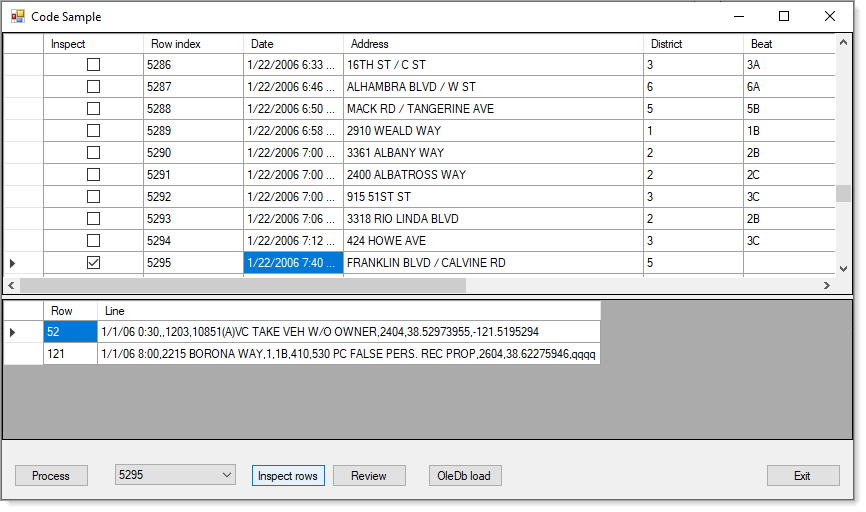
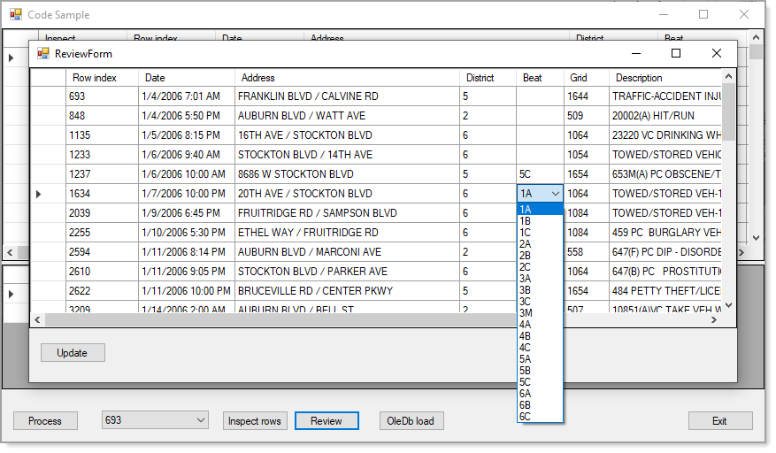

# About 

For TechNet article [C#: Processing CSV files](https://social.technet.microsoft.com/wiki/contents/articles/52030.c-processing-csv-files-part-1.aspx) 

This series will explore various aspects for importing a CSV file with comma-separated-values (.csv) into a SQL-Server database.  CSV files are a common way to share data in plain text format from sources such as a database table(s) to another database e.g. from SQL-Server to an Oracle database. 

When data exported from a database to a client database that has a matching database table(s) with matching columns the process is not always simple, for example business rules may indicate new incoming data can’t overwrite existing data or incoming data needs to be merged with existing data.

In `the wild` rarely is a simple import possible as database data types all have the same basic types but are handled differently from database to database. Couple this with a flat CSV file may need to be split up into multiple database tables.

 

## C#: Processing CSV files (Part 1A)

This [article](https://social.technet.microsoft.com/wiki/contents/articles/53436.c-processing-csv-files-part-1a.aspx) is a continuation of a series on parsing delimited text file leading off with current code in this Visual Studio solution.  This article will discuss prevalidation ideas rather than performing all parsing and validation together.

What should be considered when parsing delimited files that the unexpected should always be considered, never think too much assertion has been performed.

:large_orange_diamond: [Source code](https://github.com/karenpayneoregon/ImportingCsvFiles1/blob/master/Example1Library/Classes/FileOperations.cs) is similar to `this repo` with several improvements.

